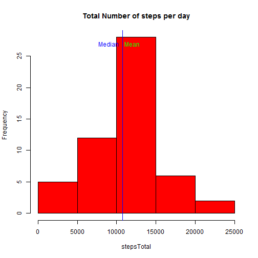
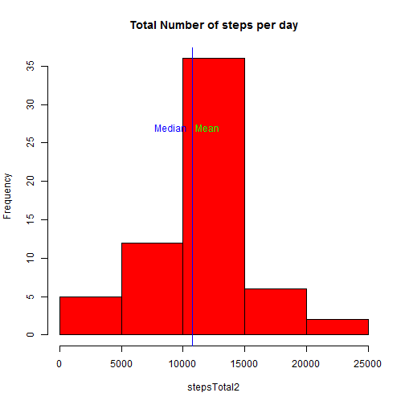

## Loading and preprocessing the data
###Load the data
Set Working directory and read CSV file

```r
setwd("C:/DataScience/05-Reproducible Research/CA-01")
rd <- read.csv("activity.csv", header = TRUE, sep = ",")
```
Process/transform the data (if necessary) into a format suitable for your analysi
For this part of the assignment, you can ignore the missing values in the dataset.

```r
rd$date <- as.Date(rd$date, "%Y-%m-%d")
rd1 <- rd[!is.na(rd$steps),]
```

## What is mean total number of steps taken per day?
Calculate the total number of steps taken per day
Calculate and report the mean and median of the total number of steps taken per day

```r
stepsTotal <- tapply(rd1$steps, rd1$date, sum)
meanST <- mean(stepsTotal)
medST <- median(stepsTotal)
```

Mean Steps per day is

```
## [1] 10766.19
```

Mediana steps per day is

```
## [1] 10765
```


Display Histogram, mean and mediana

```r
hist(stepsTotal, main = "Total Number of steps per day", col = "red")
abline(v=meanST, col="green", lwd=1)
abline(v=medST, col="blue", lwd=1)

text(12000, 27, "Mean", col = "green")
text(9000, 27, "Median", col = "blue")
```

 


## What is the average daily activity pattern?
Calculate the average using aggregate function for the intervals

```r
stepPerInt <- aggregate(rd1$steps, list(rd1$interval), mean)

maxSteps <- max(stepPerInt$x)
MaxInterval <- stepPerInt$Group.1[stepPerInt$x==max(stepPerInt$x)]
```
Then plot result. Point maximum of steps and show it.

```r
plot(x<- stepPerInt$Group.1, y <- stepPerInt$x, type = "l", xlab = "Steps", ylab = "Interval")
points(MaxInterval, maxSteps, pch = 23, col="red", bg="red")
text(MaxInterval+150, maxSteps, MaxInterval, col="red")
```

 


## Imputing missing values
Calculate and report the total number of missing values in the dataset 
(i.e. the total number of rows with NAs), show results

```r
MissinVal <- nrow (rd[is.na(rd$steps),])

#message("Missing values:")
#message(MissinVal)
MissinVal
```

```
## [1] 2304
```

**Devise a strategy for filling in all of the missing values in the dataset - Using mean for that 5-minute interval.**
Create a new dataset that is equal to the original dataset but with the missing data filled in.

```r
rd2 <- rd[is.na(rd$steps),]
    for (n in stepPerInt$Group.1){
        rd2$steps[rd2$interval == n] <- stepPerInt$x[stepPerInt$Group.1 == n]
    }

rd3 <- rbind(rd1, rd2)        
```

Calculate the total number of steps taken per day

```r
stepsTotal2 <- tapply(rd3$steps, rd3$date, sum)
```

Calculate and report the mean and median of the total number of steps taken per day
Show like histogram with mean and mediana

```r
    hist(stepsTotal2, main = "Total Number of steps per day", col = "red")
abline(v=mean(stepsTotal2), col="green", lwd=1)
abline(v=median(stepsTotal2), col="blue", lwd=1)

text(12000, 27, "Mean", col = "green")
text(9000, 27, "Median", col = "blue")
```

 

Mean Steps per day for a new data set is

```
## [1] 10766.19
```

Mediana steps per day for a new data set is

```
## [1] 10766.19
```


**Result:
Impact of inserting mean values for NA is - mean do not changed and median changed very slightly. Histogram grews evenly.**  

  
  

## Are there differences in activity patterns between weekdays and weekends?
Setting transformation constants and transform data with new factors

```r
weekLab = c("понедельник","вторник","среда","четверг","пятница","суббота","воскресенье")
weekfact = c("weekday","weekday","weekday","weekday","weekday","weekend","weekend")
rd3 <-  transform(rd3, WF = factor(weekdays(rd3$date), exclude = TRUE, 
                                   levels = weekLab, labels = weekfact))
```

```
## Warning in `levels<-`(`*tmp*`, value = if (nl == nL) as.character(labels)
## else paste0(labels, : duplicated levels in factors are deprecated
```

Plot resuts

```r
library(lattice)
#Calculate the total number of steps taken per day
stepPerInt3 <- aggregate(rd3$steps, list(rd3$WF, rd3$interval), mean)
xyplot(stepPerInt3$x ~ stepPerInt3$Group.2 | stepPerInt3$Group.1, type = "l", layout=c(1,2),
       xlab = "Interval", ylab = "Steps number")
```

```
## Warning in `levels<-`(`*tmp*`, value = if (nl == nL) as.character(labels)
## else paste0(labels, : duplicated levels in factors are deprecated
```

 


###Conclusion:
###At the weekend people usually get up later and go to sleep later (i.e. they are on the rest... no training in the morning!) then at the weekday when the go to work.

